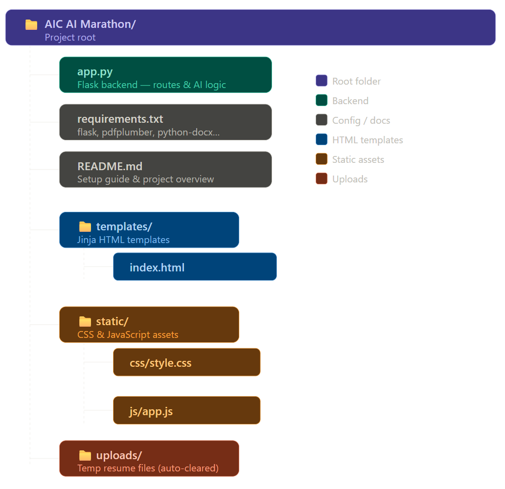
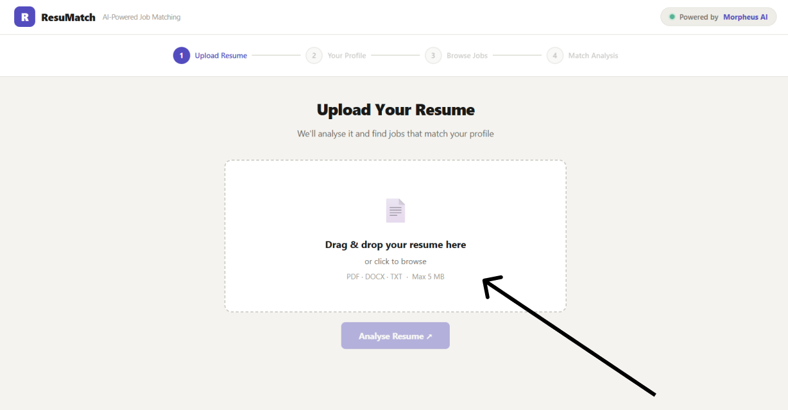
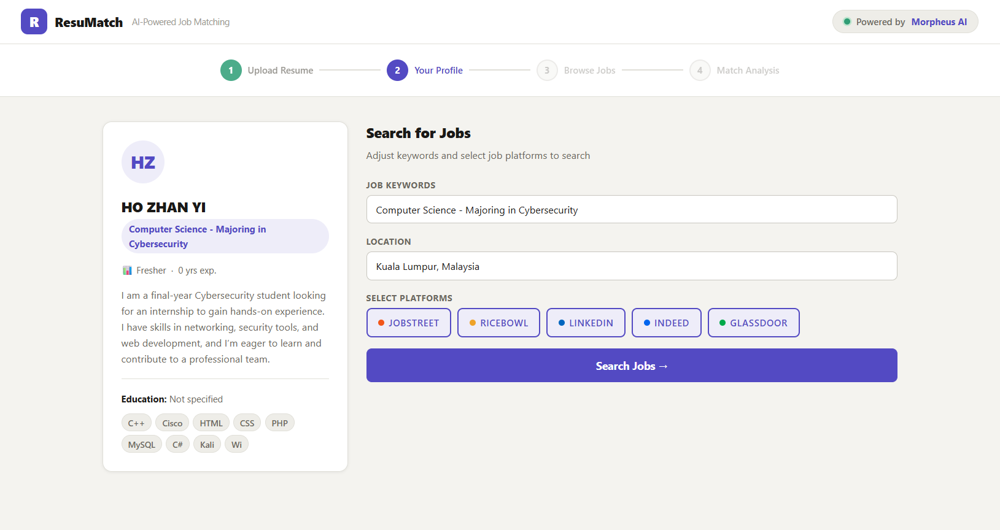
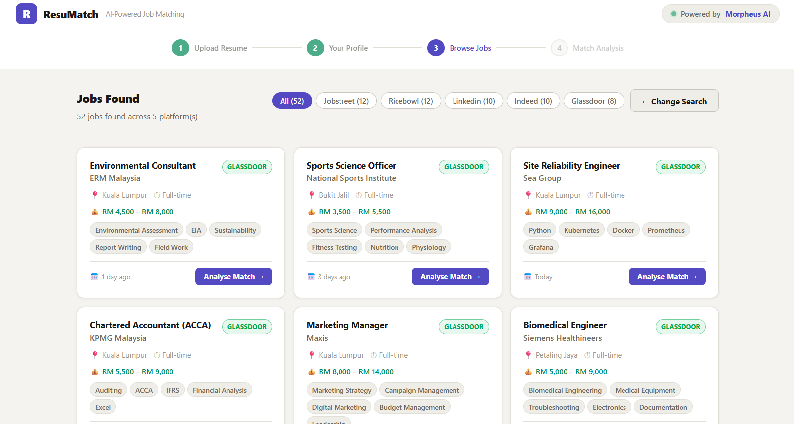
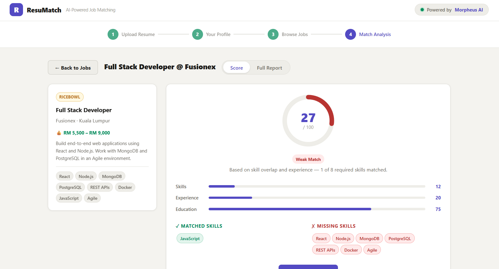
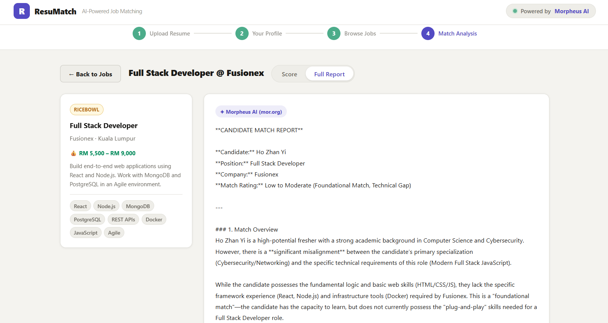

# AI Hackathon (AIC)

# Problem Statement


# Project Structure



# User Manual

## For set up (using terminal command for setup_

Install your python (Python 3.10 or newer recommended)

### Step 1: Download and unzip file

1. download the project file (AIC_AI_Marathon.zip)
2. Right click ZIP file → extract all → choose folder (see you download in which folder)

### Step 2: Open project VS code

1. Open VS code
2. Click File → Open Folder
3. Select Folder (AIC AI Marathon)

### Step 3: Open terminal

1. On the top left corner of Vs Code, click 'Terminal'
2. Click 'New Terminal'

### Step 4: Allow script execution (one time setup)

Run this command to allow PowerShell scripts to run pc

```python
Set-ExecutionPolicy -ExecutionPolicy RemoteSigned -Scope CurrentUser
```

### Step 5: Create a virtual environment

```python
python -m venv venv
```

### Step 6: Activate virtual environment

```python
venv\Scripts\Activate.ps1
```

You will see (venv) appear at the head of your terminal line — this means it worked:

(venv) PS C:\Users\YourName\...\AIC AI Marathon>

> **Important:** Every time you close and reopen VS Code, you must run this activate command again before starting the app.

### Step 7: Install Required Libraries

```python
pip install -r requirements.txt
```

This downloads and installs all the Python packages the app needs (Flask, pdfplumber, etc.). Wait until it finishes — it may take 1–2 minutes.

### Step 8: Run the app

```python
python app.py
```

You should see output:

```python
* Running on http://127.0.0.1:5000
Press CTRL+C to quit
```

### Step 9: open in browser

Open your web browser and go to

```python
http://127.0.0.1:5000
```

Or hold on the Ctrl key and click on 'http://127.0.0.1:5000' in vs code terminal

## How to use this AI job checker



1. Press/drop your Resume in this box
2. After drop the resume, press "analysis resume"



1. The user can choose select platform that they wanted to find.
2. After select completed, user can press "search jobs" into next page



1. The jobs found page view show a list of available jobs for application
2. The user can press "Analyze Match" to check it (will go to the next page)





1. User can check whether the job is suitable to his/her field
2. User can read the full report whether the user is match with this job or not